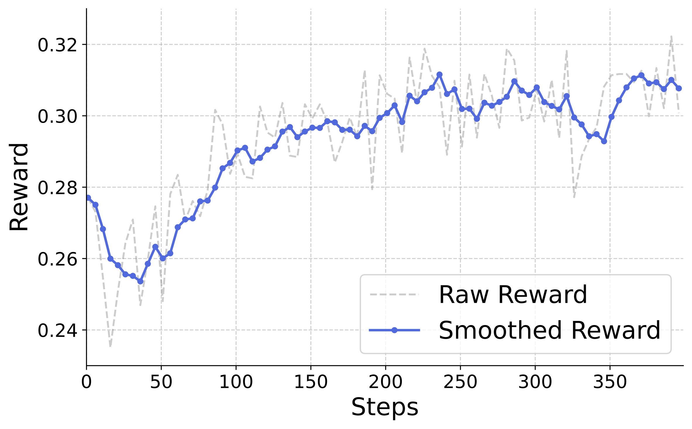

# SimpleAR: Pushing the Frontier of Autoregressive Visual Generation

[](https://arxiv.org/abs/2504.11455)&#160;
<a href='https://huggingface.co/papers/2504.11455'></a>
<a href='https://huggingface.co/Daniel0724/SimpleAR'></a>
<br>


<div style="text-align: center; margin-top: 0px;">
  <a href="https://arxiv.org/abs/2504.11455" target="_blank" style="text-decoration: none; color: #007acc;">
    SimpleAR: Pushing the Frontier of Autoregressive Visual Generation through Pretraining, SFT, and RL
  </a><br><br>
  <a href="https://wdrink.github.io/">Junke Wang</a><sup>1</sup>, 
<a href="https://zhitian.xyz/">Zhi Tian</a><sup>2</sup>, Xun Wang<sup>2</sup>, Xinyu Zhang<sup>2</sup>, Weilin Huang<sup>2</sup>, <a href="https://zxwu.azurewebsites.net/">Zuxuan Wu</a><sup>1</sup>, Yu-Gang Jiang<sup>1</sup><br>
  <sup>1</sup>Fudan University, <sup>2</sup>ByteDance Seed
  <br>
</div>


<br>

<!-- <a style="display: block; text-align: center; margin-top: 20px;"></a> -->

## ## Instruction by yuwei
**Step I**: 
```
git clone https://github.com/yuweiyang-anu/SimpleAR_Code2Chart.git
```

**Step II**: 
```
docker pull ruler136/simplear_docker:latest
```

**Step III**: Start the docker, and activate the simpar env:
```
sudo docker run -it \
--gpus all \
--ipc=host \
--name simplear_container \
-v ~/openseg_blob:/openseg_blob \
ruler136/simplear_docker:latest \
bash -c "cd /openseg_blob && exec /bin/bash"
```

```
cd /openseg_blob/xxx/SimpleAR_Code2Chart
conda activate simpar
```

**Step IV**: Training:
First Step (**Optional, has done, skip to run the script**): Extract the visual tokens, gen_resolution: 512 for pretrain, gen_resolution: 1024 for sft / RL
```
bash ./scripts/tokens/extract_token_pretrain.sh
bash ./scripts/tokens/extract_token.sh 
```
For your own code and data, you need to modified the path (py path (path of extract_token.py), code_path (path of generate discrete code of input images) and gen_data_path (path of json file for input image paths and caption/python_code)) in the extract_token_pretrain.sh or extract_token.sh files.

After generating the visual tokens, run the following py file to generate the meta information (json file that store the path of visual tokens): (need to modify the 'root' and 'total' (number for running) for your own data)
```
python3 generate_meta.py
```

**Now run the script for different requirements**：

For Pretrain:
```
bash ./scripts/train/pretrain_code2chart.sh
```

For SFT:
```
bash ./scripts/train/sft_code2chart.sh
```

For GRPO:
```
pip install vllm==0.7.2
bash ./scripts/train/grpo_code2chart.sh
```

For SFT on 10 Images:
```
bash ./scripts/train/sft_code2chart_10_images.sh
```

You can modify the path in above 4 scripts to adapt your own **data**, **model** and **save_checkpoints**, also the **wandb api_key** for loss visualization.

**Generation**

For code2chart generation (on chartmmic benchmark) using the SimpleAR-1.5B-RL model: (use vllm serving for acceleration)
```
python3 generate_code2chart_on_chartmmic.py --vllm_serving
```

For other generation: (use vllm serving for acceleration)
```
python3 generate.py --vllm_serving --prompts "xxxxx"
```
You can modify the parameters (like **model-path** (i.e., model for test) or **save_dir** (i.e., save path for generated images)) in the **generate_code2chart_on_chartmmic.py** or **generate.py**

## ################################################################################
========= Original SimpleAR Instruction ===========
## Introduction

This paper presents SimpleAR, a vanilla autoregressive visual generation model that achieves state-of-the-art text-to-image generation performance. First the first time, we demonstrate that:

- 🏆 with only 0.5B parameters, an AR model can generate 1024 resolution images with high fidelity, and achieve competitive results on challenging T2I benchmarks, e.g., 0.59 on GenEval and 79.66 on DPG;
- 🚀 both supervised fine-tuning (SFT) and Group Relative Policy Optimization (GRPO) training could lead to significant improvements on image aesthectics and prompt alignment;
- ⚡️ when deployed with vLLM, the throughput of our model allows for generating 1024 resolution images in 14 seconds, making high-resolution generation practical for real-world applications. 

We open-sourced all the training and inference code, hoping to show the potential of autoregressive visual generation and encourage more participation in this research field.

## Models & Scripts

### Installation

Please follow the instructions below to install the environment:

```bash
python3 -m venv env

source env/bin/activate

pip install -e ".[train]"

cd transformers

pip install -e .

cd ..
```

## Model Zoo

We provide both SFT and RL checkpoints:

| name              | GenEval |  DPG  |                         HF weights 🤗                         |
| :---------------- | :-----: | :---: | :----------------------------------------------------------: |
| SimpleAR-0.5B-sft |  0.53   | 79.34 | [0.5B-sft](https://huggingface.co/Daniel0724/SimpleAR/tree/main/simplear_0.5B_sft) |
| SimpleAR-0.5B-rl  |  0.59   | 79.66 | [0.5B-grpo](https://huggingface.co/Daniel0724/SimpleAR/tree/main/simplear_0.5B_rl) |
| SimpleAR-1.5B-sft |  0.61   | 80.11 | [1.5B-sft](https://huggingface.co/Daniel0724/SimpleAR/tree/main/simplear_1.5B_sft) |
| SimpleAR-1.5B-rl  |  0.63   | 81.31 | [1.5B-grpo](https://huggingface.co/Daniel0724/SimpleAR/tree/main/simplear_1.5B_rl) |

We use [Cosmos](https://huggingface.co/nvidia/Cosmos-1.0-Tokenizer-DV8x16x16) as our visual tokenizer, you can download and put it under *./checkpoints/*:

```bash
cd checkpoints

git lfs install

git clone https://huggingface.co/nvidia/Cosmos-1.0-Tokenizer-DV8x16x16
```

## Training

### Data Preparation

We cache the visual tokens for efficient training. Below is the command to extract visual tokens with Cosmos Tokenizer:

```bash
torchrun \
--nnodes=1 --nproc_per_node=8 \
simpar/data/extract_token.py \
    --dataset_type "image" \
    --dataset_name "example" \
    --code_path "/path_to_saved_tokens" \
    --gen_data_path "/path_to_meta_json" \
    --gen_resolution 1024
```

You can specify the meta data file with *--gen_data_path*, which should be a json file with the following format:

```
{
  "image_path": "path_to_image",
  "caption": "a photo of a cat"
}
```

After this, you can use *./scripts/tokens/generate_meta.py* to prepare a meta file.

### Pretrain and SFT

For both pretraining and SFT, we use the following command to train the model:

```bash
ACCELERATE_CPU_AFFINITY=1 \
torchrun \
    --nnodes=4 \
    --nproc_per_node=8 \
    llava/train/train_mem.py \
    --deepspeed scripts/zero3.json \
    --model_name_or_path "/path_to_your_dir/Qwen2.5-0.5B-Instruct" \
    --version "qwen_1_5" \
    --gen_data_path /path_to_annotation_file \
    --gen_image_folder "" \
    --sample_short True \
    --mm_tunable_parts="mm_language_model" \
    --p_drop_cond 0.1 \
    --mm_use_im_start_end False \
    --mm_use_im_patch_token False \
    --mm_patch_merge_type spatial_unpad \
    --bf16 True \
    --run_name test \
    --output_dir /path_to_output_dir \
    --num_train_epochs 1 \
    --per_device_train_batch_size 8 \
    --per_device_eval_batch_size 1 \
    --gradient_accumulation_steps 2 \
    --evaluation_strategy "no" \
    --save_strategy "steps" \
    --save_steps 5000 \
    --learning_rate 1e-4 \
    --weight_decay 0.01 \
    --warmup_ratio 0.0 \
    --lr_scheduler_type "constant" \
    --logging_steps 1 \
    --tf32 True \
    --model_max_length 1536 \
    --dataloader_num_workers 16 \
    --lazy_preprocess True \
    --torch_compile True \
    --torch_compile_backend "inductor" \
    --dataloader_drop_last True \
    --report_to wandb \
    --attn_implementation sdpa
```

We set *--model_max_length* to # of visual tokens + 512, i.e., 1536 for 512 pretraining and 4608 for 1024 SFT.

### GRPO

We follow [Open-R1](https://github.com/huggingface/open-r1) to implement GRPO training with [trl](https://github.com/huggingface/trl), please refer to *./scripts/env_rl.sh* to set up the environment. Then you can run:

```bash
accelerate launch --main_process_port 1234 --config_file llava/configs/accelerate_configs/zero3.yaml \
    --num_processes=7 llava/train/llava_trainer_grpo.py \
    --config llava/configs/config_grpo.yaml \
    --data_path /path_to_annotation_file
```

We spent lots of time to tune the hyper-parameters and improve the training efficiency. After this, we observed quite promising reward curves 😄:
<br>

<a style="display: block; text-align: left; margin-top: 10px;"></a>


## Evaluation and Inference

### Benchmark Evaluation 

We provide the scripts to evaluate our model on [GenEval](https://github.com/djghosh13/geneval) and [DPG-Bench](https://github.com/TencentQQGYLab/ELLA/tree/main/dpg_bench) under *./scripts/eval*:

```bash
CUDA_VISIBLE_DEVICES=0,1,2,3,4,5,6,7 bash scripts/eval/bench_dpg.sh
```

Please follow the instructions in their repo to calculate the metrics.

### Inference with vLLM and SJD

vLLM could significantly improve the inference efficiency, you can first install it from [this repo](https://github.com/wdrink/vllm):

```
git clone https://github.com/wdrink/vllm

cd vllm

pip install -e .

cd ..

mv vllm vllm_local

mv vllm_local/vllm ./
```

then pass *--vllm_serving* in the evaluation script to try vLLM.

We also implement [speculative jacobi decoding (SJD)](https://arxiv.org/abs/2302.01318), you can try it with *--sjd_sampling*.

### Play with Our Model

You can play with SimpleAR with the following command:

```
python3 generate.py
```

## Visualizations

<p align="left">
  
  
  <br>
  <em>1024 x 1024 generation results by SimpleAR.</em>
</p>


## Citation

If you find this repository helpful, please consider citing:

```bib
@article{wang2025simplear,
    title={SimpleAR: Pushing the Frontier of Autoregressive Visual Generation through Pretraining, SFT, and RL},
    author={Wang, Junke and Tian, Zhi and Wang, Xun and Zhang, Xinyu and Huang, Weilin and Wu, Zuxuan and Jiang, Yu-Gang},
    journal={arXiv preprint arXiv:2504.11455},
    year={2025}
}
```

## Acknowledgement

We thank [Peize Sun](https://peizesun.github.io/) for the valuable discussions.
